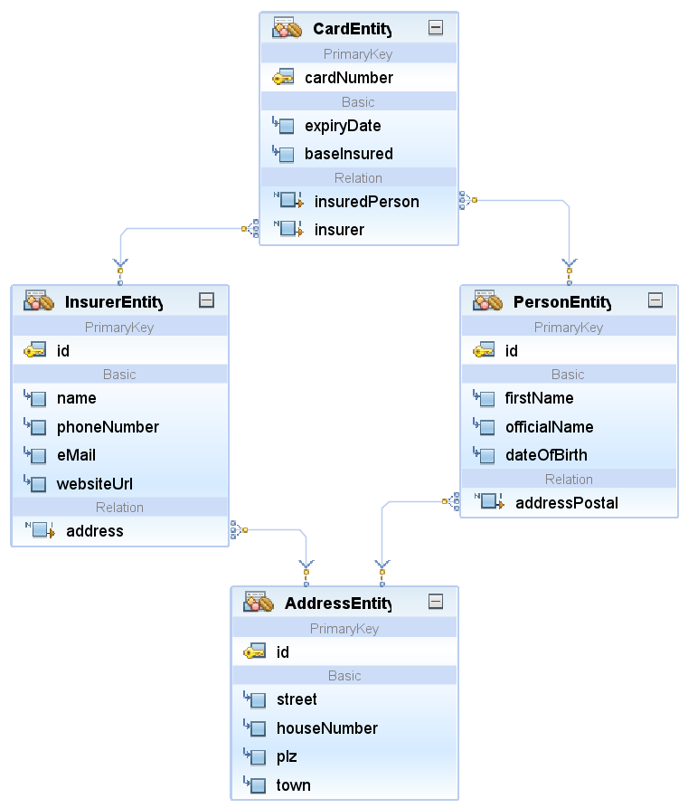

# VeKa-Center-Austauschdienst (veka-center-auskunftsdienst)

> Autoren der Dokumentation: Björn Scheppler

> Dokumentation letztmals aktualisiert: 4.10.2019

Dieses **Maven**-Projekt simuliert den **Versichertenkarten-Auskunftsdienst**, welcher Operationen über **REST** zu Versichertenkarten, Versicherten und Versicherern bereitstellt.

Dieses Projekt wird in der [**eUmzugPrototyp-Lösung**](https://github.com/zhaw-gpi/eumzug-plattform-2018) verwendet, welche [eumzug.swiss](https://www.eumzug.swiss) nachbildet. Erarbeitet am [**Institut für Wirtschaftsinformatik** an der ZHAW School of Management and Law](http://www.zhaw.ch/iwi) im Rahmen des [Bachelor-Studiengangs Wirtschaftsinformatik](https://www.zhaw.ch/de/sml/studium/bachelor/wirtschaftsinformatik/) im [**Modul Geschäftsprozessintegration**](https://modulmanagement.sml.zhaw.ch/StaticModDescAblage/Modulbeschreibung_w.BA.XX.2GPI-WIN.XX.pdf).

## Komponenten / Funktionalität
1. **Spring Boot**-Applikation mit Tomcat Server, usw.
2. **Persistierung**skomponenten:
    1. **H2**-Datenbank
    2. Karte-, Versicherer-, Person- und Adress-**Entitäten** gemäss folgendem Modell:

    3. Zu allen Entitäten **JPA-Repositories**
    4. data.sql mit initialen Testdaten, die beim Starten der Applikation in die Datenbank eingefügt werden.
3. **REST-Komponenten** und **Geschäftslogik**:
    1. Spring Boot Web-Komponenten für das Anbieten von REST-Services
    2. RESTController-Klassen für das RequestMapping von Ressourcen:
        1. CardRestController: Zugriff auf Methoden im Zusammenhang mit Versichertenkarten (momentan ausgeben aller Karten sowie einer Karte basierend auf der Versicherten-Kartennummer)
        2. InsurerRestController: Zugriff auf Methoden im Zusammenhang mit Versichereren (momentan ausgeben aller versicherer, eines Versicherers basierend auf BAG-Nummer sowie Hinzufügen eines neuen Versicherers)
        3. PersonRestController: Zugriff auf Methoden im Zusammenhang mit versicherten Personen (momentan Ändern der Adresse)
4. **Frontend-Komponenten**:
    1. Statische Welcome-Webseite index.html, welche einer REST API-Dokumentation entspricht
    2. Dynamische Webseite mit einer Liste aller registrierten Versicherern, basierend auf:
        1. Thymeleaf-Templating Engine
        2. ThymeLeaf-Template InsurerListTemplate

5. **Test-Fälle** als soapUI-Projekt (src\test\resources\VeKa-REST-API-soapui-project.xml)

## Deployment
1. **Erstmalig** oder bei Problemen ein `mvn clean install` durchführen
2. Bei Änderungen am POM-File oder bei **(Neu)kompilierungsbedarf** genügt ein `mvn install`

## Nutzung
### Allgemein
1. Für den **Start** ist ein `java -jar .\target\NAME DES JAR-FILES.jar` erforderlich. Dabei wird Tomcat gestartet, die Datenbank erstellt/hochgefahren mit den Eigenschaften (application.properties) und die verschiedenen Resourcen-URL-Mappings vorgenommen.
2. Beim Starten werden die **Insert-Statements** in src\main\ressources\data.sql ausgeführt.
3. http://localhost:8070 aufrufen => Eine **Willkommens-Seite** mit Dokumentation wird angezeigt.
4. http://localhost:8070/insurerer aufrufen => Eine **Liste aller Versicherer** wird angezeigt.
5. Das **Beenden** geschieht mit **Stop Build/Run (Netbeans)**, respektive **CTRL+C** (Cmd)

### REST-Client allgemein
Am einfachsten mit **soapUI** und dem entsprechenden Testprojekt die REST-Requests testen. Die verfügbaren URLs sind aber auch unter http://localhost:8070 aufgeführt.

### REST-Client Umzugsplattform
Hierzu den Anweisungen folgen in https://github.com/zhaw-gpi/eumzug-plattform-2018.

### Fortgeschrittene Nutzung (Datenbank-Konsole)
1. Um auf die Datenbankverwaltungs-Umgebung zuzugreifen, http://localhost:8070/console eingeben.
2. Anmeldung über:
    1. Benutzername sa
    2. Passwort: leer lassen
    3. URL jdbc:h2:./DATENBANKNAME_GEMAESS_APPLICATION.PROPERTIES

## Mitwirkende
1. Björn Scheppler: Hauptarbeit
2. Peter Heinrich: Der stille Support im Hintergrund mit vielen Tipps sowie zuständig
für den Haupt-Stack mit SpringBoot & Co.
3. Studierende Markus Cristelotti, Angela Keller, Tim Schrödel, Dominik Straub, Matthias Urech und Philipp Winter (Equals-Methode für Adress-Entity)
4. Studierende Simon Degiorgi, Martin Knecht, Thomas Landolt, Janick Michot, Romeo Weber und Manuel Weiss (Example-Einsatz und mehr in PersonRestController)
